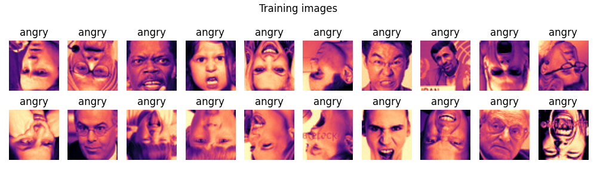
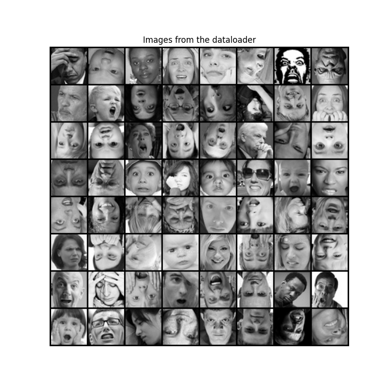
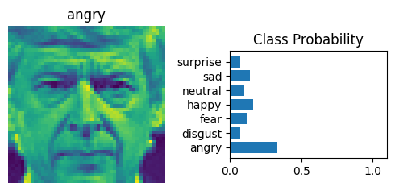

# Facial Expression Recognition

A project for recognizing facial expressions using deep learning.


## Overview

This project is a Facial Expression Recognition system that utilizes Deep Learning to classify human emotions based on facial images. The system consists of:

- Machine Learning Pipeline: Includes training, validation, and inference scripts for model development.
- Docker Support: Containerized setup for easier deployment.
- Makefile Automation: Simplifies running common tasks.

## Dataset

To use this project, clone the dataset repository:

```bash
!git clone https://github.com/parth1620/Facial-Expression-Dataset
```

OR use the Makefile to download the dataset:

```bash
make download_dataset
```



## Features

✅ **Facial Expression Recognition**: Predicts emotions from uploaded images using a CNN model.
✅ **Data Augmentation**: Utilizes Albumentations for robust model generalization.
✅ **Model Evaluation**: Includes various metrics to assess model performance.
✅ **Pre-trained EfficientNet**: Leverages transfer learning for better accuracy.
✅ **Configuration-based Execution**: Uses YAML files for training, validation, and inference settings.
✅ **Poetry for Dependency Management**: Ensures reproducibility and organized package management.
✅ **Docker Support**: Containerized deployment for easy setup.
✅ **Makefile for Automation**: Streamlines common commands.

---

## Installation

### Prerequisites

- Python **3.10+**
- Poetry for dependency management ([Installation Guide](https://python-poetry.org/docs/))
- Docker & Docker Compose

### Setup

```bash
# Clone the repository
git clone https://github.com/benintw/facial_expression_recognition.git
cd facial-expression-recognition

# Install dependencies
poetry install
```

---

## Usage



1. Build the Docker image

```bash
make build
```

2. Run the Docker container

```bash
make run
```

3. Stop the Docker container

```bash
make stop
```

4. Check the status of the Docker container

```bash
make check
```

---

## Configuration

All hyperparameters and settings are managed via **YAML configuration files**:

- `configs/training.yaml` → Training settings (batch size, learning rate, etc.)
- `configs/validation.yaml` → Validation settings
- `configs/inference.yaml` → Inference settings
- `configs/model.yaml` → Model settings (architecture, etc.)
- `configs/dataset.yaml` → Dataset settings (dataset path, etc.)
- `configs/checkpoints.yaml` → Checkpoint settings (checkpoint path, etc.)

Modify these files to adjust training and evaluation parameters.

---

## Dependencies

This project uses **Poetry** for package management. The key dependencies include:

```toml
[dependencies]
numpy = ">=2.2.3,<3.0.0"
pandas = ">=2.2.3,<3.0.0"
scikit-learn = ">=1.6.1,<2.0.0"
torch = ">=2.6.0,<3.0.0"
albumentations = ">=2.0.5,<3.0.0"
timm = ">=1.0.15,<2.0.0"
fastapi = ">=0.115.11,<0.116.0"
uvicorn = ">=0.34.0,<0.35.0"
streamlit = ">=1.43.0,<2.0.0"
requests = ">=2.32.3,<3.0.0"
```

To install new dependencies:

```bash
poetry add package_name
```

---

## Docker Configuration

The project is containerized with the following Dockerfile:

```dockerfile
# Use an official Python runtime as the base image
FROM python:3.11-slim

# Set working directory
WORKDIR /app

# Install system dependencies (git for cloning dataset, other tools as needed)
RUN apt-get update && apt-get install -y --no-install-recommends \
    git \
    make \
    libgl1-mesa-glx \
    libglib2.0-0 \
    && rm -rf /var/lib/apt/lists/*

# Install Poetry
RUN pip install --no-cache-dir poetry

# Copy the entire project
COPY . .

# Install dependencies
RUN poetry install --no-interaction --no-ansi

# Ensure scripts are executable
RUN chmod +x scripts/*.sh

# Expose port for FastAPI
EXPOSE 8000

# Command to run the application
CMD ["poetry", "run", "make", "all"]

```

---

## Makefile

The Makefile includes targets for building, running, and managing the Docker container:

```makefile
# Default config file paths
TRAIN_CONFIG ?= configs/training.yaml
VAL_CONFIG ?= configs/validation.yaml
PRED_CONFIG ?= configs/inference.yaml

# Download dataset
download_dataset:
	@echo "Downloading dataset..."
	@./scripts/download_dataset.sh
	@echo "Dataset downloaded successfully."

# Visualize dataset
visualize_dataset:
	@echo "Visualizing dataset..."
	@poetry run python scripts/visualize_dataset.py
	@echo "Dataset visualized successfully."

# Training command
train:
	@echo "Starting training..."
	@./scripts/train.sh
	@echo "Training completed. Check logs/train_*.log for details."

# Validation command
validate:
	@echo "Starting validation..."
	@./scripts/validate.sh
	@echo "Validation completed. Check logs/validate_*.log for details."

# Prediction command
predict:
	@echo "Starting prediction..."
	@./scripts/predict.sh
	@echo "Prediction completed. Check predictions/ for outputs."

# Run all steps in sequence
all: download_dataset train validate predict
	@echo "All steps completed successfully."

# Clean generated files
clean:
	rm -rf outputs/*
	rm -rf __pycache__/*
	rm -rf data/*
	rm -rf checkpoints/*
	rm -rf logs/*
	rm -rf predictions/*

# Docker commands
build:
	@echo "Building Docker image..."
	@./docker-build.sh
	@echo "Docker image built successfully."

run:
	@echo "Running Docker container..."
	@./docker-run.sh
	@echo "Container execution completed."

stop:
	@echo "Stopping Docker containers..."
	@./docker-stop.sh
	@echo "Containers stopped."

check:
	poetry check

.PHONY: train validate predict all clean check download_dataset visualize_dataset build run stop

```

## Future Improvements 🚀

- Real-time Prediction: Integrate OpenCV for webcam-based recognition.
- Mobile App: Develop a mobile version using Flutter or React Native.
- Improved Model Performance: Experiment with Vision Transformers (ViTs).
- Multi-language Support: Add localization to the Streamlit frontend.
- Cloud Deployment: Deploy on AWS/GCP/Azure.
- Database Integration: Store predictions for analytics.

---

## Author

👤 **Ben Chen**\
📧 [chen.ben968@gmail.com](mailto:chen.ben968@gmail.com)\
🔗 [GitHub Profile](https://github.com/benintw)
